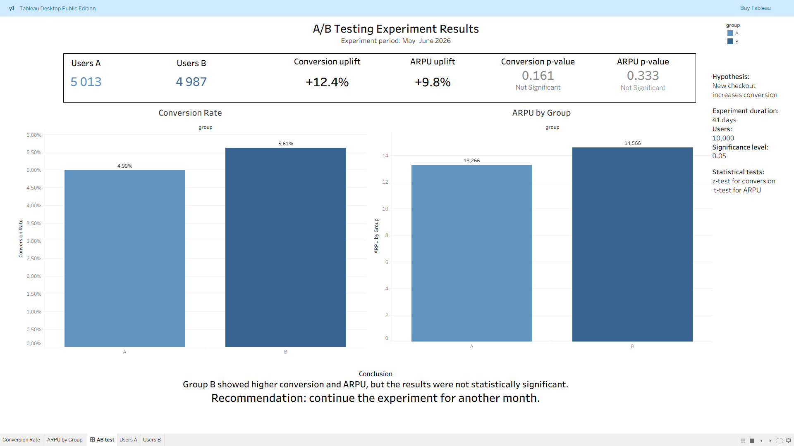

# A/B Test Analysis for Guest Checkout Optimization

## Project Overview

This project analyzes an A/B test designed to evaluate the impact of a simplified checkout process (guest checkout) on user behavior and business metrics.

The goal of the experiment was to determine whether reducing the number of required fields during the checkout flow could improve conversion rate and ARPU.

---

## Experiment Design

In the control group (A), users completed the standard checkout process with full registration:

- first name
- last name
- email
- username
- password

In the experimental group (B), a guest checkout flow was introduced, requiring only an email address to complete the purchase.

---

## Metrics

### Primary Metric
- Conversion Rate

### Secondary Metric
- ARPU (Average Revenue Per User)

---

## Project Structure

```text
data/
│── ab_test_data.csv

src/
│── data_generation.py
│── load_data.py
│── eda.py
│── ab_analysis.py

visualization/
│── AB_test.twbx
│── AB_test.png
```

---

## Analysis

Using Python, the following steps were completed:

- generated a synthetic dataset for A/B testing;
- performed exploratory data analysis (EDA);
- conducted a z-test for conversion rate;
- conducted Welch’s t-test for ARPU;
- built a 95% confidence interval for conversion uplift.

---

## Results

| Metric | Group A | Group B |
|---|---|---|
| Conversion Rate | 4.99% | 5.61% |
| ARPU | 13.27 | 14.57 |

### Statistical Tests

| Test | p-value |
|---|---|
| Conversion Rate | 0.161 |
| ARPU | 0.333 |

### 95% Confidence Interval for Conversion Uplift

[-0.25%, 1.51%]

---

## Visualization

A Tableau dashboard was created to visualize the experiment results.



---

## Interpretation

Group B demonstrated higher conversion rate and ARPU values, but the observed differences were not statistically significant at α = 0.05.

The confidence interval for conversion uplift includes 0, which means the experiment does not provide sufficient evidence to confidently confirm a real effect.

However, most of the confidence interval lies in the positive range, suggesting a potentially positive impact of the simplified checkout flow.

---

## Business Recommendation

It is recommended to continue the experiment for another month in order to increase statistical power and obtain more reliable results.